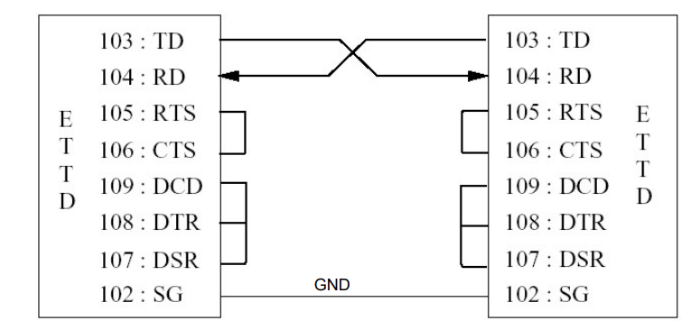
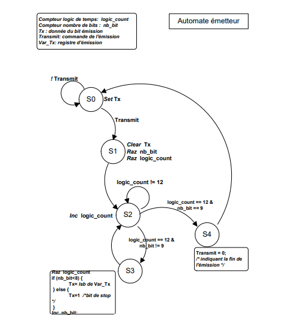
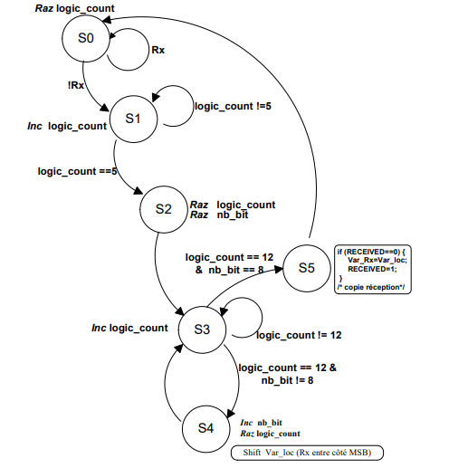

# TP Transmission Réception: UART

## Introduction
Ce projet est réalisé dans le cadre du module "Instrumentation et interfaçage des systèmes embarqués" de mon Master 2 à l'université Paris-Saclay.

## Objectifs
L'objectif est d'implémenter la norme V24 de la communication UART en Verilog et de développer un bloc IP optimisé en taille, destiné à devenir un périphérique MMIO pouvant être intégré dans un SoC.



## Matériel Utilisé
Actuellement, j'utilise une carte de développement SiSpeed Tang Nano 9K basée sur un FPGA Gowin GW1NR-9LV C5/6. Cependant, le but est de rendre le bloc matériel agnostique et synthétisable sur n'importe quel FPGA.

## Structure du Projet
La structure du projet est organisée comme suit :
```plaintext
.
├── Readme.md
├── UART Verilog
│   ├── TopLevel.v
│   ├── UART IP.gprj
│   ├── UART IP.gprj.user
│   ├── gowin_clkdiv
│   │   ├── gowin_clkdiv.ipc
│   │   ├── gowin_clkdiv.mod
│   │   ├── gowin_clkdiv.v
│   │   └── gowin_clkdiv_tmp.v
│   ├── gowin_osc
│   │   ├── gowin_osc.ipc
│   │   ├── gowin_osc.mod
│   │   ├── gowin_osc.v
│   │   └── gowin_osc_tmp.v
│   ├── uart_rx.v
│   ├── uart_top.v
│   └── uart_tx.v
├── include
│   ├── LIBTP2.H
│   └── LIBTP2.OBJ
└── src
    └── uart.c
```


## Architecture du Système

### Module UART TX (uart_tx) :
- Implémente la transmission UART.
- Utilise une FSM (Machine à États Finis) pour gérer les transitions entre les états : repos, bit de démarrage, bits de données, bit d'arrêt, terminé.
- Le signal RTS est activé lorsque l'émetteur est prêt à envoyer, et désactivé à la fin de la transmission.
- L'entrée CTS garantit que l'émetteur n'envoie des données que lorsque le récepteur est prêt.




### Module UART RX (uart_rx) :
- Implémente la réception UART.
- Utilise une FSM pour gérer la détection du bit de démarrage, la réception des bits de données, le bit d'arrêt, et le stockage des données reçues.
- Le signal CTS est activé lorsque le récepteur est prêt à accepter les données, et désactivé à la fin de la réception.
- RTS est une entrée provenant de l'émetteur, et le récepteur échantillonne les bits entrants.



### Module Principal (uart_top) :
- Combine les modules de transmission et de réception.
- Connecte le signal `tx` de l'émetteur à l'entrée `rx` du récepteur, simulant une boucle de retour (loopback).
- Le signal `tx_done` est activé à la fin de la transmission, et `rx_done` est activé à la fin de la réception.

## Tests et Validation
Les tests ont été réalisés en utilisant une boucle de retour (loopback) pour vérifier la fonctionnalité complète du système. Des signaux de test ont été injectés dans le module `uart_tx`, et la correspondance des données reçues via le module `uart_rx` a été validée.

## Résultats
Les résultats ont confirmé la conformité avec la norme V24, ainsi que la robustesse des modules `uart_tx` et `uart_rx`. Les signaux RTS et CTS ont fonctionné comme attendu, assurant une communication fiable.
